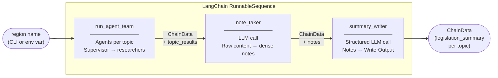
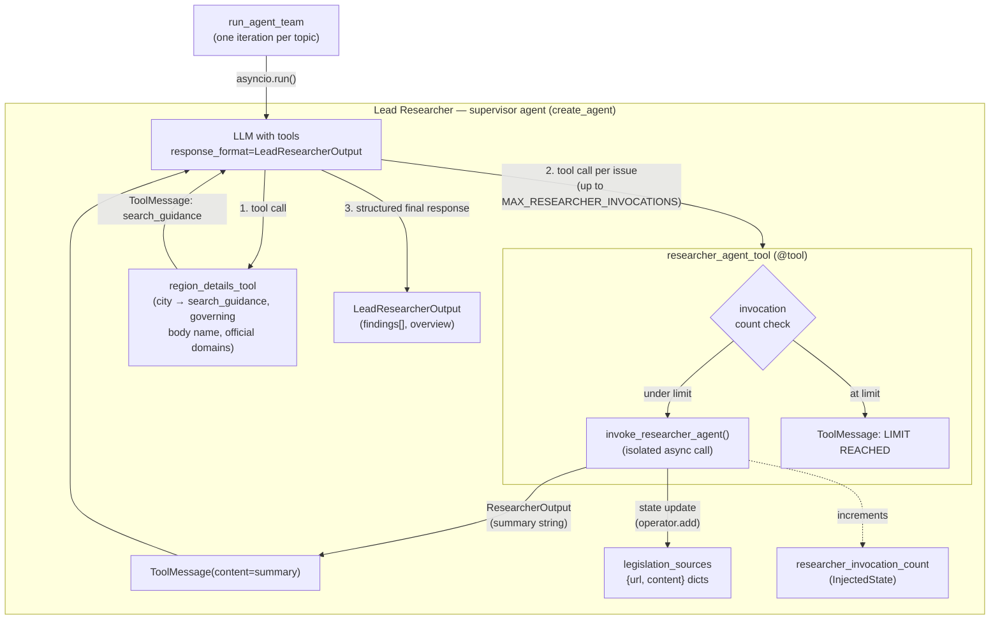
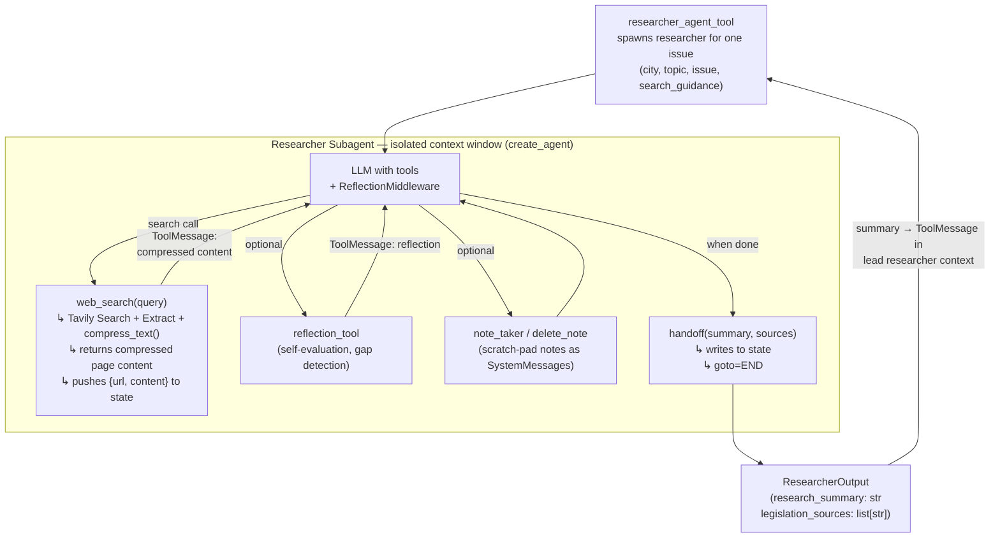
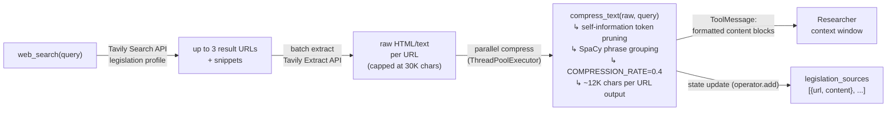
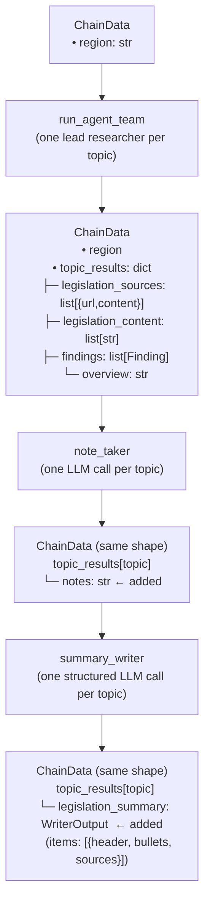
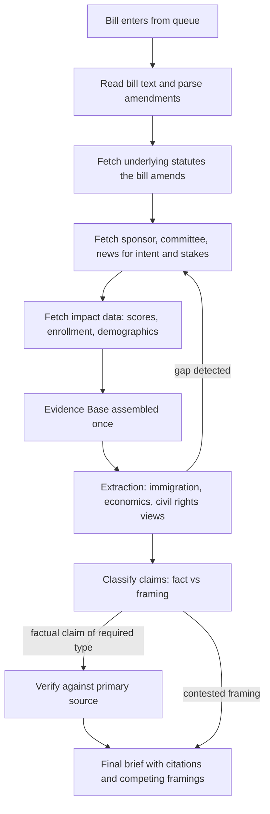
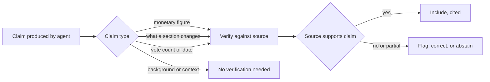

# Agentic Architecture

A system that ingests legislation for a city, resolves what each bill actually changes, researches its real-world impact and the disagreement around it, and delivers topic-specific, cited briefs to subscribers.

## Problem

There is no easily accessible service that tells a non-expert what is actually happening in legislation. The hard part is not tracking that bills exist. It is that bills are written as diffs against existing law, their stakes live outside the text, and their real impact requires external data. A useful product has to read a bill the way an analyst would, not just summarize its words.

## Core design principles

These were the load-bearing conclusions. Everything else follows from them.

1. **Discovery is deterministic, not agentic.** Finding bills is a data problem. An LLM makes it flakier and more expensive, not better.
1. **One gatherer agent per bill, one shared context.** The connections between a bill's economic, social, and civil-rights effects are often the most important finding. Isolating those into separate agents destroys that value and re-reads the bill three times.
1. **Discovery lives in exactly one place.** The gatherer pulls all background up front. Downstream steps reframe what was gathered. They do not go fetch new facts.
1. **Parallelism is across bills, not within a bill.** Many bills are independent work. That is a job queue with bounded concurrency, which is infrastructure, not a multi-agent architecture.
1. **Verification is triggered by rule and grounded in sources.** Factual claims get checked by claim type, always, against the primary document. The model does not get to decide when it is sure, and reflection is not verification.
1. **The bias engine is retrieval and display discipline, not neutralized language.** Surface competing framings with attribution. Do not launder contested claims into fake-neutral prose.

---

## System overview

The pipeline is a fixed, deterministic three-node LangChain sequence. Node order is hardcoded in `pipelines/nv_local.py`. The only agentic behavior is inside `run_agent_team` — the other two nodes are single-shot LLM calls.

All state is carried in a single `ChainData` TypedDict. Each node reads what it needs, appends its output, and passes the dict forward.

---

## The supervisor-as-tool pattern

`run_agent_team` runs one **lead researcher** per topic. The lead researcher is a supervisor agent implemented with `create_agent`. Its distinguishing property: it delegates to researcher subagents not by handing off to a subgraph, but by calling `researcher_agent_tool` — a regular LangChain `@tool` that wraps a full subagent invocation.

This is the supervisor-as-tool pattern. The supervisor's context window only ever sees a summary string back from each subagent call, never the subagent's internal tool call history. Context isolation is structural, not manual.

The supervisor never sees individual search queries or page content from the researchers — only the final summary each one produces. This keeps the supervisor's context window small regardless of how many web searches the researchers ran.

---

## Researcher subagent: ReAct loop

Each `researcher_agent_tool` call constructs a fresh researcher agent with its own context window. It runs a full multi-turn ReAct loop and terminates by calling `handoff`, which writes its output directly to graph state via `goto=END`.

The researcher's context — all search results, reflections, and notes — is discarded after `handoff` returns. The supervisor receives only `research_summary`.

---

## web_search: inline extraction and compression

The `web_search` tool does more than search. It fetches full page content and compresses it before writing anything to the researcher's context, so the researcher reads actual legislative text rather than snippets.

Short pages under `MIN_CHARS_TO_COMPRESS=1000` chars bypass compression entirely. Compression failures fall back to capped raw content so the researcher always has something to evaluate.

---

## State and data flow

`ChainData` is the single shared TypedDict that flows through the entire pipeline. State never moves sideways between topics — each topic accumulates its own result block inside `topic_results`.

`legislation_sources` inside each topic result is the reconciled set — deduplicated and reliability-filtered by `gather_citations()` in `run_agent_team` before being passed downstream. `legislation_content` is extracted from the `content` field of those same dicts, so no separate fetch step is needed downstream.

---

## Per-bill pipeline (target state)

The architecture above handles topic-level discovery across existing legislation. The target state is bill-level resolution: a pipeline that reads a bill as a diff, resolves what each amendment actually changes, and verifies claims against primary sources.

---

## Verification

The model cannot be trusted to know when it is wrong, and this is a legal-liability domain. So verification is not invoked at the model's discretion and is not a reasoning loop. It is rule-triggered and source-grounded.

Reflection makes an argument more internally coherent. It does not make a fact true. A grounded check opens the actual bill text or score and confirms the specific claim against it. That is the only thing that protects you in this domain.

---

## Why the bill text alone is not enough

The gatherer must search broadly because the document never tells the whole story.

1. **Bills are diffs, not standalone documents.** A bill may strike one figure and insert another. You need the underlying statute to know what that figure funds. The text tells you a number changed, not what it does.
1. **Intent and stakes live outside the text.** Who pushed it, why, who benefits, and who is fighting it come from press releases, testimony, lobbying records, and coverage.
1. **Real-world impact needs external data.** A change to an eligibility threshold only becomes meaningful with current enrollment numbers, demographics, and prior scores.
1. **Bills reference other bills and events.** A response to a court ruling, or a law being amended by several pending bills at once, is context the document does not carry.

This justifies broad search in the gatherer. It does not justify arming the extraction passes. Search expands in one place.

---

## Cost strategy

The exponential cost fear came from within-bill fan-out and inter-agent messaging, both of which are removed by the design above. Remaining levers:

- **Batch endpoints** for non-interactive calls, at roughly half the real-time price. Batch the inputs to the queue, not the interactive agent loops themselves.
- **Prompt caching** for repeated system prompts and shared referenced statutes.
- **Multi-model routing.** A cheap fast model handles classification and routing. A frontier model handles the reasoning that needs it.
- **Token budgets per step**, with truncation rather than unbounded spiraling. `AGENT_RECURSION_LIMIT=40` and `MAX_RESEARCHER_INVOCATIONS` are the two current hard limits.
- **Per-source compression.** `compress_text()` at `COMPRESSION_RATE=0.4` reduces each fetched page to ~40% of its capped size before it enters any context window. This alone has the largest per-run token impact.

The number that actually decides viability is cost per bill multiplied by bills per run. That has to be measured, not assumed.

---

## Rejected alternatives

Kept here so they do not get re-litigated later.

- **Multi-agent swarm with shared discoveries.** Contexts are either isolated or shared. You cannot have both without paying for the messaging twice. Token-bleeding and hard to audit.
- **Per-link or per-topic sub-agents within a bill.** Redundant searching, severed cross-topic connections, compounding cost.
- **Two agents arguing for and against a bill.** They generate plausible arguments rather than researching real impact. Theater, not analysis. Real opposing views come from real sourced people.
- **An LLM council that stress-tests arguments.** Expensive, and one model judging another's coherence is circular. A human reviewing the brief is the real stress test and the actual moat.
- **Fine-tuning a source-bias classifier.** Encodes your own labeling as invisible deterministic bias. Use an external audited dataset instead.
- **Fine-tuning to neutralize political language.** Hides the disagreement, which is the most dangerous form of bias. Surface framings instead.
- **Verification triggered by the model's own sense of confidence.** Models are confidently wrong. Trigger by claim type.
- **Subagraph-based supervisor (LangGraph handoff to subgraph).** Subagent context leaks into the supervisor's message history unless manually trimmed. Tool wrapping gives structural isolation for free.

---

## Open questions and real risks

- **Legal accuracy is a liability, not a polish item.** A wrong claim about what a bill does is a reputational and possibly legal problem. The amendment-resolution and verification steps have to be near-perfect, and the system has to abstain rather than guess.
- **Political neutrality is core product.** The moment briefs read as partisan, a large part of the market will not touch it. Sourcing balance and fact-versus-framing discipline are features, not finishing touches.
- **Most political decisions cannot be simulated.** Validated quantitative models exist only for narrow domains such as tax and benefits. Anything broader should be clearly labeled as un-modeled rather than given fake quantitative backing.
- **One context may not be enough per bill.** The current topic-level researchers handle this by looping on multiple issues, but bill-level resolution with amendment tracking may exceed a single context budget. Measure first.
