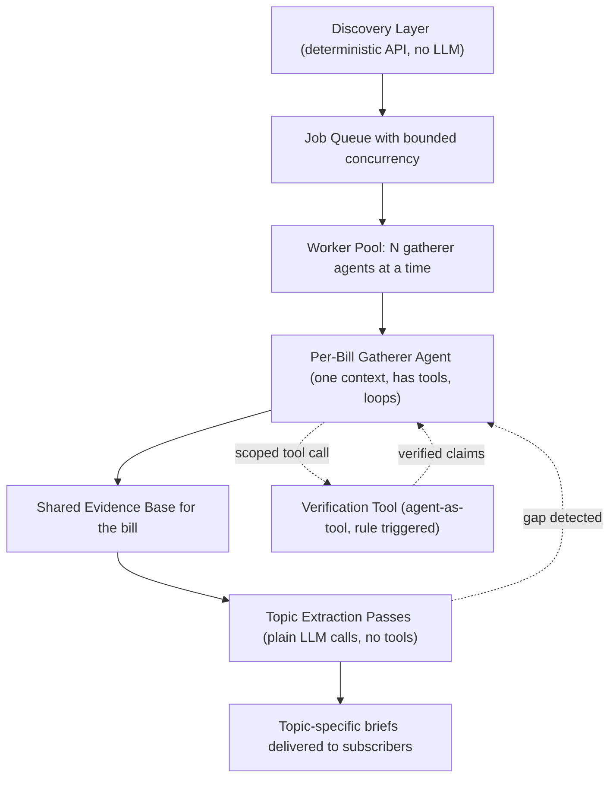
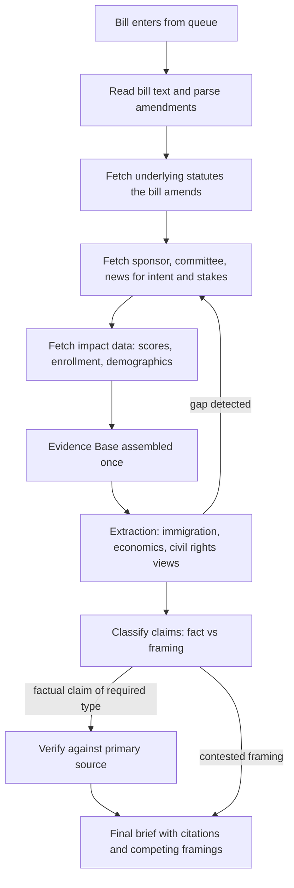
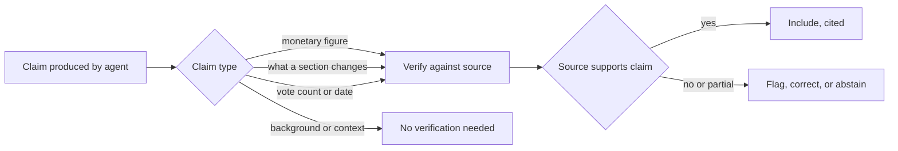

# Agentic Architecture

A system that ingests legislation for a city, resolves what each bill actually changes, researches its real-world impact and the disagreement around it, and delivers topic-specific, cited briefs to subscribers.

## Problem

There is no easily accessible service that tells a non-expert what is actually happening in legislation. The hard part is not tracking that bills exist. It is that bills are written as diffs against existing law, their stakes live outside the text, and their real impact requires external data. A useful product has to read a bill the way an analyst would, not just summarize its words.

## Core design principles

These were the load-bearing conclusions. Everything else follows from them.

1. **Discovery is deterministic, not agentic.** Finding bills is a data problem. An LLM makes it flakier and more expensive, not better.
1. **One gatherer agent per bill, one shared context.** The connections between a bill’s economic, social, and civil-rights effects are often the most important finding. Isolating those into separate agents destroys that value and re-reads the bill three times.
1. **Discovery lives in exactly one place.** The gatherer pulls all background up front. Downstream steps reframe what was gathered. They do not go fetch new facts.
1. **Parallelism is across bills, not within a bill.** Many bills are independent work. That is a job queue with bounded concurrency, which is infrastructure, not a multi-agent architecture.
1. **Verification is triggered by rule and grounded in sources.** Factual claims get checked by claim type, always, against the primary document. The model does not get to decide when it is sure, and reflection is not verification.
1. **The bias engine is retrieval and display discipline, not neutralized language.** Surface competing framings with attribution. Do not launder contested claims into fake-neutral prose.

## System overview

## Components

### Discovery layer

A deterministic source of legislation for a given city or jurisdiction (a legislative API or data provider such as LegiScan for US state and local). No LLM. This layer is responsible for completeness and reliability, which an agent doing web search cannot guarantee.

### Job queue with bounded concurrency

Bills are independent jobs. A worker pool processes a fixed number of bills at once, set by budget and rate limits. This is the only real parallelism in the system. It scales cost linearly with bills processed rather than exponentially.

### Per-bill gatherer agent

One agent, one context window, with tool access and a loop. It is responsible for all discovery for a single bill:

- Read the bill text and parse the amendments it makes.
- Fetch the underlying statutes the bill amends, so a changed number has meaning.
- Fetch sponsor statements, committee testimony, and news to capture intent and stakes.
- Fetch impact data such as CBO scores, enrollment figures, and demographics.

The output is a single shared evidence base for the bill.

### Topic extraction passes

Plain LLM calls with no tools. Each pass filters the shared evidence base into a topic-specific view (for example immigration, economics, civil rights), because one bill can touch several topics and users subscribe per topic. These passes reframe gathered material. They do not discover new facts. If a pass finds a genuine gap, it sends a signal back to the gatherer rather than going to search itself.

### Verification tool

An agent-as-tool, hidden behind a clean tool interface so the main context stays uncluttered. It is invoked by rule based on claim type, and it works by comparison against the primary source. Details below.

### Bias and transparency layer

Not a fine-tuned model and not language softening. The system retrieves across the spectrum for contested points, separates fact from framing, attributes framing to whoever holds it, cites everything to an openable source, and is allowed to say a claim is contested rather than manufacturing a neutral-sounding take. Source-lean judgments use external audited datasets rather than a self-trained classifier, so the bias is transparent and external rather than baked in invisibly.

## Per-bill pipeline

## Why the bill text alone is not enough

The gatherer must search broadly because the document never tells the whole story.

1. **Bills are diffs, not standalone documents.** A bill may strike one figure and insert another. You need the underlying statute to know what that figure funds. The text tells you a number changed, not what it does.
1. **Intent and stakes live outside the text.** Who pushed it, why, who benefits, and who is fighting it come from press releases, testimony, lobbying records, and coverage.
1. **Real-world impact needs external data.** A change to an eligibility threshold only becomes meaningful with current enrollment numbers, demographics, and prior scores.
1. **Bills reference other bills and events.** A response to a court ruling, or a law being amended by several pending bills at once, is context the document does not carry.

This justifies broad search in the gatherer. It does not justify arming the extraction passes. Search expands in one place.

## Verification

The model cannot be trusted to know when it is wrong, and this is a legal-liability domain. So verification is not invoked at the model’s discretion and is not a reasoning loop. It is rule-triggered and source-grounded.

Reflection makes an argument more internally coherent. It does not make a fact true. A grounded check opens the actual bill text or score and confirms the specific claim against it. That is the only thing that protects you in this domain.

## Cost strategy

The exponential cost fear came from within-bill fan-out and inter-agent messaging, both of which are removed by the design above. Remaining levers:

- **Batch endpoints** for non-interactive calls, at roughly half the real-time price. Batch the inputs to the queue, not the interactive agent loops themselves.
- **Prompt caching** for repeated system prompts and shared referenced statutes.
- **Multi-model routing.** A cheap fast model handles classification and routing. A frontier model handles the reasoning that needs it.
- **Token budgets per step**, with truncation rather than unbounded spiraling.

The number that actually decides viability is cost per bill multiplied by bills per run. That has to be measured, not assumed.

## Rejected alternatives

Kept here so they do not get re-litigated later.

- **Multi-agent swarm with shared discoveries.** Contexts are either isolated or shared. You cannot have both without paying for the messaging twice. Token-bleeding and hard to audit.
- **Per-link or per-topic sub-agents within a bill.** Redundant searching, severed cross-topic connections, compounding cost.
- **Two agents arguing for and against a bill.** They generate plausible arguments rather than researching real impact. Theater, not analysis. Real opposing views come from real sourced people.
- **An LLM council that stress-tests arguments.** Expensive, and one model judging another’s coherence is circular. A human reviewing the brief is the real stress test and the actual moat.
- **Fine-tuning a source-bias classifier.** Encodes your own labeling as invisible deterministic bias. Use an external audited dataset instead.
- **Fine-tuning to neutralize political language.** Hides the disagreement, which is the most dangerous form of bias. Surface framings instead.
- **Verification triggered by the model’s own sense of confidence.** Models are confidently wrong. Trigger by claim type.

## Open questions and real risks

- **Nothing here has been built or measured yet.** The fastest way to resolve the remaining design questions, including whether one context is enough and what a bill costs to process, is to ship the thinnest one-agent version and run real bills through it.
- **Legal accuracy is a liability, not a polish item.** A wrong claim about what a bill does is a reputational and possibly legal problem. The amendment-resolution and verification steps have to be near-perfect, and the system has to abstain rather than guess.
- **Political neutrality is core product.** The moment briefs read as partisan, a large part of the market will not touch it. Sourcing balance and fact-versus-framing discipline are features, not finishing touches.
- **Most political decisions cannot be simulated.** Validated quantitative models exist only for narrow domains such as tax and benefits. Anything broader should be clearly labeled as un-modeled rather than given fake quantitative backing.