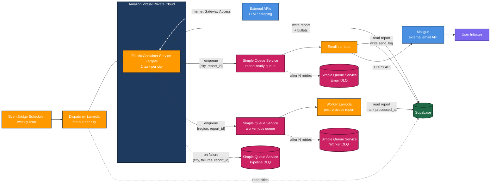
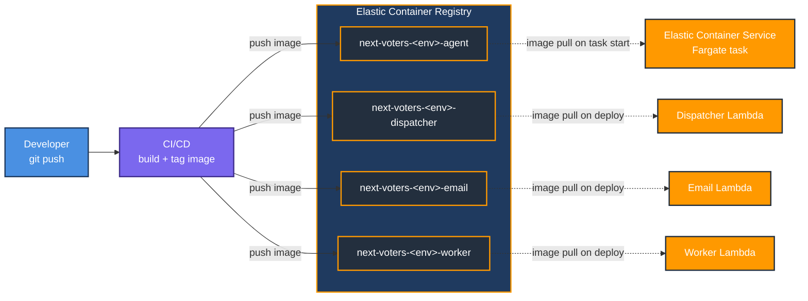

# AWS Architecture

This document covers two concerns:

1. **Pipeline Execution** — the runtime flow that generates reports and emails subscribers on a weekly cron.
2. **CI/CD Infrastructure** — the build and image-management process that maintains the Docker images consumed by the pipeline.

---

## 1. Pipeline Execution

### Flow Summary

1. **EventBridge** triggers the **Dispatcher Lambda** on a weekly cron.
2. **Dispatcher Lambda** reads the active cities from **Supabase** and fans out one **Elastic Container Service Fargate** task per city.
3. Each **Fargate task** calls external APIs (LLM, scraping) to generate report content, writes the report and its bullets to **Supabase**, then enqueues a message to the **report-ready queue** (`{city, report_id}`) for the Email Lambda and a message to the **worker-jobs queue** (`{region, report_id}`) for the Worker Lambda, and exits. If any topic or either SQS enqueue fails, the task sends failure metadata to the **Pipeline Dead Letter Queue** before exiting 1.
4. **Simple Queue Service** holds the message. AWS-managed pollers invoke the **Email Lambda** with batches of messages. Lambda reserved concurrency caps parallel executions to protect Mailgun rate limits.
5. **Email Lambda** reads the report and bullets from Supabase, queries subscribers for the city, renders the email, sends via **Mailgun** (HTTPS API; API key read from SSM), and writes to `send_log` for idempotency.
6. Failed Email Lambda messages are retried automatically by Simple Queue Service. After N failures, they land in the **Email Dead Letter Queue** for investigation. Pipeline-side failures land in the separate **Pipeline Dead Letter Queue** directly from the Fargate task.
7. In parallel with email delivery, **Simple Queue Service** invokes the **Worker Lambda** with each `{region, report_id}` message. The Worker Lambda reads the report from Supabase, verifies it belongs to the given region, and stamps `reports.processed_at`. It returns SQS partial-batch responses, so a message that fails validation or the write is retried and, after N attempts, lands in the **Worker Dead Letter Queue**. Supabase credentials are read from SSM at cold start.

---

## 2. CI/CD Infrastructure

### Repositories

| Repository | Consumer | Purpose |
|---|---|---|
| `next-voters-<env>-agent` | Elastic Container Service Fargate | LangGraph agent that scrapes external sources, calls LLMs, and generates report bullets |
| `next-voters-<env>-dispatcher` | Dispatcher Lambda | Reads active cities from Supabase and fans out Fargate tasks |
| `next-voters-<env>-email` | Email Lambda | Renders email templates and sends via Mailgun |
| `next-voters-<env>-worker` | Worker Lambda | Consumes `{region, report_id}` from the worker-jobs queue and post-processes the saved report (marks `reports.processed_at`) |

### Deployment Flow

1. Code is pushed to the application repository.
2. CI builds a Docker image and pushes it to the corresponding Elastic Container Registry repository, tagged with the commit SHA.
3. Lambda functions are updated to point to the new image tag. Lambda caches the image until the next deploy.
4. Fargate task definitions reference the desired image tag and pull the image when a new task starts.
